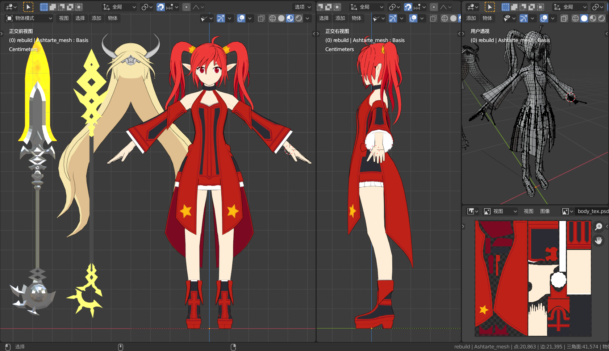
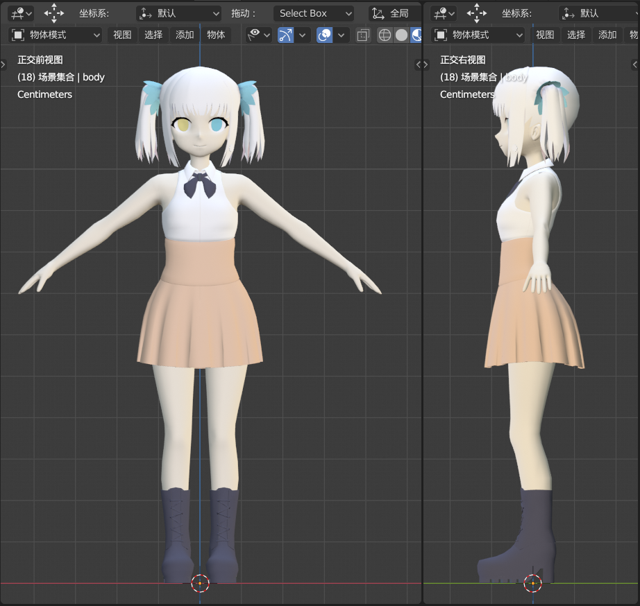
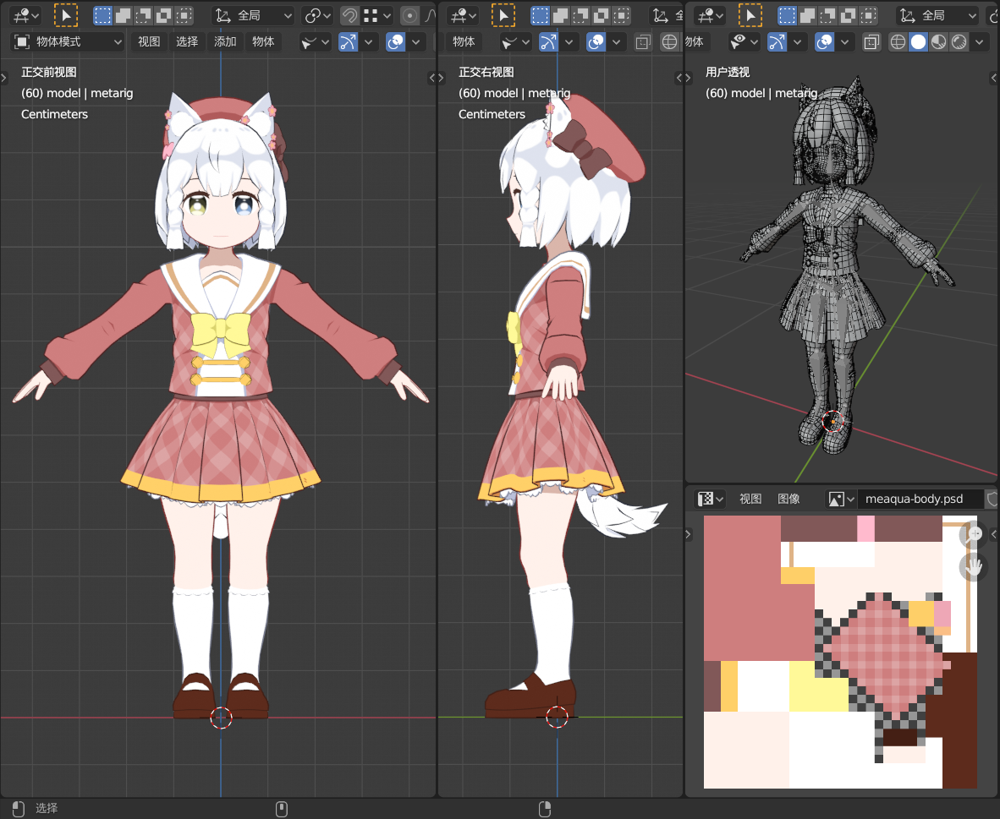

# 建模作品

20年年初入门3D建模后陆续用blender做的一些人物模型

### DNF——战斗法师
虽然不玩DNF了但还是挺喜欢战法的形象的，于是就做出来在各种游戏demo中客串

### VTuber——神乐Meu
从一个做独立游戏的神乐Mea单推人那里接到的委托。不过还没做完。

### VTuber——神乐阿库娅
这个模型中尝试了很多入门shader后才学到的技术，比如用顶点色控制描边颜色和宽度、用类似本村线的手法标记固定阴影区域，还把UV展成方格状防止纹理走样、甚至为了配合衣服上的斜方格把UV块给倾斜了45度。

效果有好有坏，但总归是尝试。

