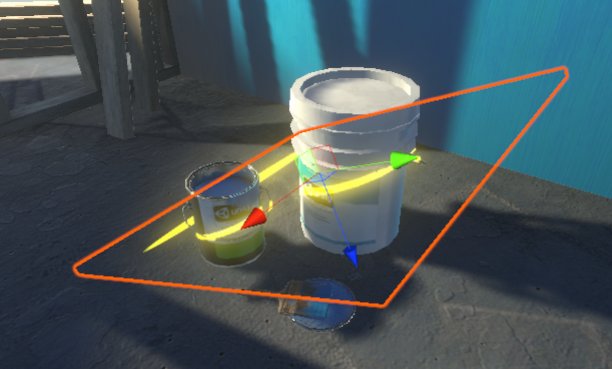
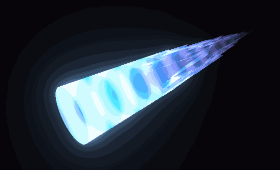
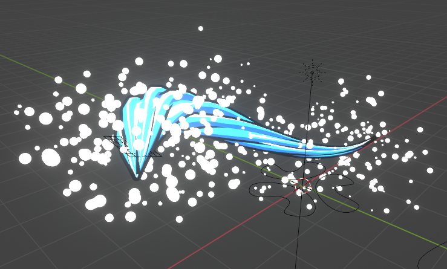

# 特效

在blender或Unity中制作的一些特效

|效果|描述|
|-|-|
|ShaderGraph特效，通过屏幕空间贴花实现的斩痕。
|ShaderGraph特效，通过顶点动画等方法实现的火箭尾烟
|几何着色器制作的草地，通过RenderTexture来控制角色和技能对草的吹拂效果
|blender/ShaderGraph特效，从普通的战矛变形成40米大刀的效果
|blender特效，水之呼吸临摹